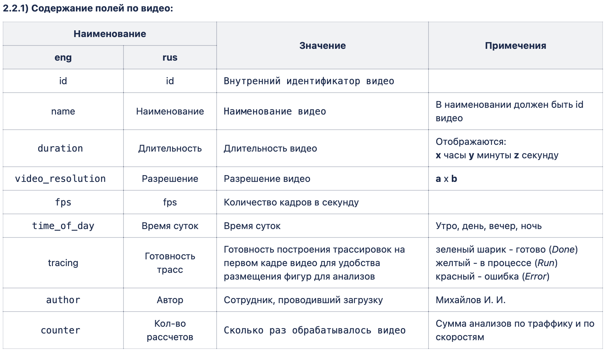
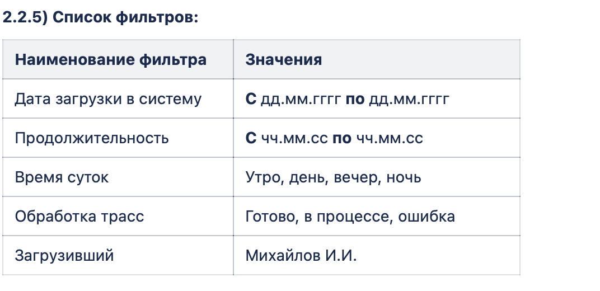

# Camera Video Map

Веб-сервис для работы с картой камер видеонаблюдения: загрузка видео с привязкой к
камере, отображение камер на карте (MapLibre GL), фильтрация камер/видео/анализов
и заглушка CV-анализа (подсчёт трафика / средней скорости).

## Возможности

- **Авторизация**: регистрация (email + ФИО + пароль), логин, JWT access + refresh
  токены в httpOnly-cookie, logout, обновление access-токена по refresh. Пароли
  хранятся только в виде bcrypt-хеша. Ролевой модели нет — все пользователи видят
  результаты обработки видео друг друга.
- **Личный кабинет** (`/dashboard`): информация о текущем пользователе + последние
  загруженные им видео, общий список всех видео с поиском по названию и по автору.
- **Карта камер** (`/`): камеры на карте (MapLibre GL, кластеризация), маленький/большой
  кружок в зависимости от того, есть ли у камеры хоть одно загруженное видео.
  Данные отдаются в формате GeoJSON, кэшируются в Redis (инвалидация — при
  загрузке нового видео) и хранятся в Postgres.
- **Список камер**: фильтры — полнотекстовый поиск по названию, диапазон
  количества загруженных видео, модель, тип, класс камеры.
- **Карточка локации** (`/cameras/{id}`): переключение между вкладками «Видео» и
  «Анализы», импорт видео (можно выбрать сразу несколько файлов — обрабатываются
  строго по очереди, один за другим, а не параллельно), фильтры по обеим вкладкам.
- **Загрузка видео**: валидация MIME-типа и расширения `.mp4`, реальная проверка
  читаемости файла через `ffprobe` (битый файл будет отклонён), извлечение
  метаданных (длительность, разрешение, fps) и первого кадра (`ffmpeg`) с
  сохранением в MinIO (S3-совместимое хранилище). Видео и кадры лежат в разных
  бакетах.
- **Анализы**: запуск и просмотр анализов по видео (`traffic` — подсчёт
  транспорта, `speed` — средняя скорость) и по камере целиком, с фильтрами по
  типу и статусу. CV-пайплайн — заглушка (`AnalysisService.run_mock_analysis`
  возвращает случайные значения); реальный алгоритм не входил в объём задачи.

## Стек

| Слой | Технологии |
|---|---|
| Backend | FastAPI, Pydantic v2, SQLAlchemy 2.0 (async), asyncpg, Alembic |
| Auth | python-jose (JWT), passlib + bcrypt |
| Хранилища | PostgreSQL, Redis (кэш GeoJSON), MinIO (видео + кадры) |
| Обработка видео | ffmpeg / ffprobe (через subprocess) |
| Frontend | Jinja2-шаблоны, ванильный JS, MapLibre GL JS |
| Тесты | pytest, pytest-asyncio, httpx (ASGI-клиент), реальный Postgres в Docker |
| Качество кода | ruff, black, mypy, pre-commit |
| Инфраструктура | Docker / docker-compose |

## Структура проекта

```
main.py                     # точка входа FastAPI-приложения
src/
  core/                     # настройки, подключения к БД/Redis/MinIO, обработка ошибок
  data/
    models/                 # SQLAlchemy-модели (Camera, Video, Analysis, User)
    repositories/           # доступ к БД, без бизнес-логики
  domain/services/          # бизнес-логика (auth, camera, video, analysis)
  api/v1/                   # REST-роутеры + Pydantic-схемы (/api/v1/...)
  web/                      # серверные страницы (Jinja2) + статика (JS/CSS)
alembic/                    # миграции БД
scripts/seed_cameras.py     # наполнение d_camera тестовыми камерами
tests/                      # pytest-тесты (unit + интеграционные)
```

## Быстрый старт (Docker, рекомендуется)

```bash
cp .env.example .env      # заполнить реальными значениями (см. ниже)
docker compose up -d --build
```

Поднимутся `db` (Postgres), `redis`, `minio`, `backend`. Миграции применяются
автоматически при старте контейнера `backend` (`entrypoint.sh` → `alembic upgrade head`).

- Приложение: http://localhost:8000
- Swagger UI: http://localhost:8000/docs
- MinIO Console: http://localhost:9001

Наполнить карту тестовыми камерами (ТЗ: «добавить рандомные значения для теста»):

```bash
docker compose exec backend python -m scripts.seed_cameras --count 50
```

Остановить: `docker compose down` (данные в volume'ах сохранятся; `docker compose down -v` — удалить и их).

## Запуск без Docker (локальная разработка)

Нужны Python 3.11+, [Poetry](https://python-poetry.org/) и локально поднятые
Postgres/Redis/MinIO (или через `docker compose up -d db redis minio`).

```bash
poetry install
cp .env.example .env      # поправить DATABASE_URL/REDIS_URL/MINIO_* под локальные адреса
poetry run alembic upgrade head
poetry run uvicorn main:app --reload
```

## Переменные окружения

Все переменные и их назначение — в [.env.example](.env.example). Обязательные:
`DATABASE_URL`, `SECRET_KEY`, `ALGORITHM`, `MINIO_ACCESS_KEY`, `MINIO_SECRET_KEY`.
Файл `.env` в `.gitignore` — не коммитится.

## Тесты

Тесты гоняются на реальном (одноразовом) Postgres, а не на моках — поднимите его:

```bash
docker run -d --name camtest-pg \
  -e POSTGRES_USER=test -e POSTGRES_PASSWORD=test -e POSTGRES_DB=test \
  -p 15432:5432 postgres:15-alpine
```

Дальше:

```bash
poetry run pytest
```

Адрес тестовой БД можно переопределить переменной `TEST_DATABASE_URL`. Видео для
тестов (`ffmpeg`/`ffprobe`) генерируются на лету — сторонние бинарники в системе
должны быть установлены (в Docker-образе `ffmpeg` уже есть).

## Качество кода

```bash
poetry run ruff check .      # линт
poetry run black .           # форматирование
poetry run mypy src main.py scripts   # типы
```

Настроен pre-commit (те же три инструмента + базовая файловая гигиена):

```bash
poetry run pre-commit install        # один раз — ставит git-хук
poetry run pre-commit run --all-files
```

## API

Полная спецификация — `/docs` (Swagger) или `/openapi.json` после запуска. Основные группы,
все под префиксом `/api/v1`:

- `POST /auth/register`, `POST /auth/login`, `POST /auth/refresh`, `POST /auth/logout`, `GET /auth/me`
- `GET /users`, `GET /users/me/dashboard`
- `GET /cameras`, `GET /cameras/geojson`, `GET /cameras/{id}`, `GET /cameras/{id}/analyses`
- `POST /videos` (загрузка), `GET /videos` (список с фильтрами)
- `POST /videos/{video_id}/analyses`, `GET /videos/{video_id}/analyses`

Аутентификация — httpOnly cookie `user_access_token`, выставляется `/auth/login`.

## Макеты

Исходные макеты страниц (главная карта / карточка локации), по которым верстался интерфейс:



